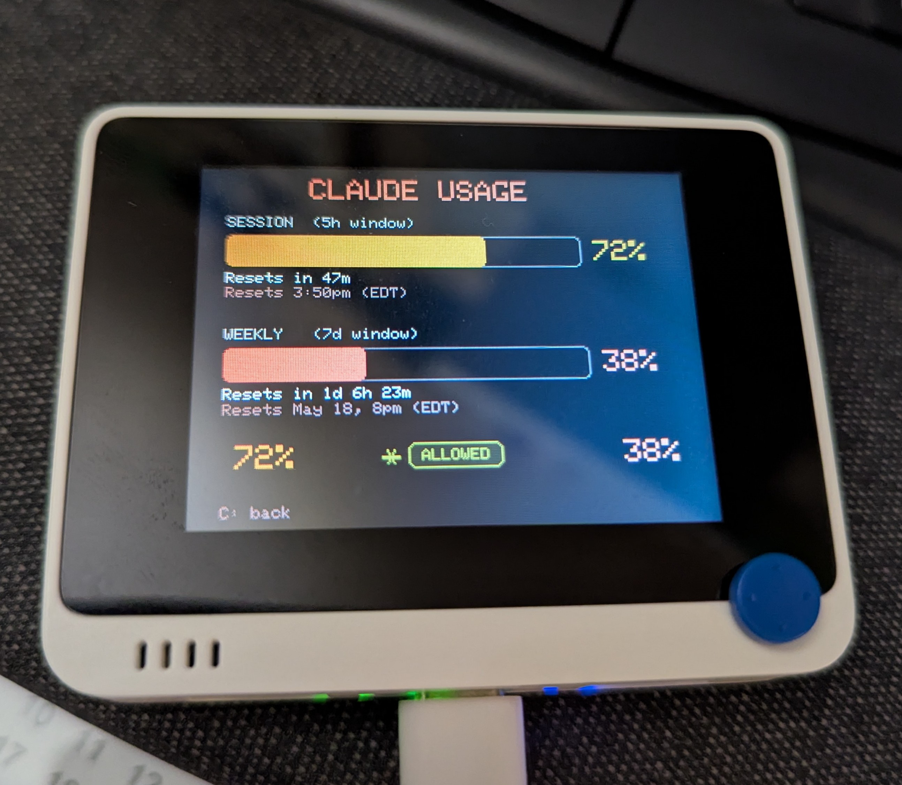

# Wio Terminal Workbench


A personal toolkit for the [Seeed Wio Terminal](https://wiki.seeedstudio.com/Wio-Terminal-Getting-Started/). Screens plug into a joystick-navigated menu — each one is a self-contained `.cpp` file. Add a screen, register it in the menu, done. Companion host-side tools live in `tools/`.

## Screens

| Screen | Description | Preview |
|---|---|---|
| **Home** | Live sensor dashboard — accelerometer (X/Y/Z bars), light level, and microphone amplitude | |
| **Claude Usage** | Displays session (5h) and weekly (7d) Claude API utilisation, fed over USB serial or BLE |  |
| **Sys Stats** | Arc gauges for CPU, RAM, GPU, VRAM usage + temperatures and network bandwidth, fed over USB serial or BLE | |
| **Settings** | Joystick-adjustable backlight brightness (5–100%) | |

## Hardware

- Seeed Wio Terminal
- (Optional) Seeed Battery Chassis 650mAh — enables the battery % overlay in the top-right corner of every screen

## Build & upload

Requires [PlatformIO](https://platformio.org/).

```bash
pio run                   # build only
pio run --target upload   # build and upload over USB
```

## Adding a screen

1. Create `src/myScreen.cpp` with a function `void myScreen()` that blocks until the user exits (KEY_C).
2. Declare it in `include/globals.h`.
3. Add an entry to `menuItems[]` and a `case` in `navigation()` in `src/homeScreen.cpp`.

Every screen has access to:

| Utility | Where |
|---|---|
| TFT display (`tft`) | `globals.h` → `TFT_eSPI` |
| Battery overlay | `drawBatteryStatus(bgColor)` in `battery.cpp` |
| BLE data channel | `bleSetActive()`, `checkBLE()` in `bluetooth.cpp` |
| Serial data channel | `checkSerial()` in `claudeUsage.cpp` |
| Backlight control | `backLight.setBrightness()` via `globals.h` |

## Navigation (hardware)

| Input | Action |
|---|---|
| KEY_A (top-right) | Jump directly to brightness screen |
| KEY_C (top-left) | Return to menu from any screen |
| Joystick UP / DOWN | Move menu selection |
| Joystick PRESS | Enter selected screen |
| Joystick LEFT / RIGHT | Adjust brightness (on brightness screen) |

## Project layout

```
src/              One .cpp per screen + main.cpp
include/          globals.h (shared state + prototypes), lcd_backlight.hpp
tools/            Host-side utilities (Python)
  claude_sender.py    Feed Claude usage data — USB serial or --ble
  sysstat_sender.py   Feed PC system stats — USB serial or --ble
  bitmap-converter/   PySide6 GUI — convert images to Wio Terminal bitmap format
```

## Host tools

Both sender scripts support USB serial and BLE via a `--ble` flag.

**`claude_sender.py`** — streams Claude API usage to the Claude Usage screen:

```bash
pip install httpx pyserial        # serial mode
pip install httpx bleak           # BLE mode

python tools/claude_sender.py COM3          # Windows serial
python tools/claude_sender.py /dev/ttyACM0  # Linux/macOS serial
python tools/claude_sender.py --ble         # BLE auto-discover
python tools/claude_sender.py --ble AA:BB:CC:DD:EE:FF  # BLE to address
```

Reads your Claude OAuth token from `~/.claude/.credentials.json` automatically.

**`sysstat_sender.py`** — streams PC system stats (CPU, RAM, GPU, network) to the Sys Stats screen:

```bash
pip install psutil pyserial              # serial mode
pip install psutil bleak                 # BLE mode
pip install nvidia-ml-py                 # optional: NVIDIA GPU stats
pip install wmi                          # optional: Windows CPU temperature (needs LibreHardwareMonitor)

python tools/sysstat_sender.py COM3                      # Windows serial
python tools/sysstat_sender.py /dev/ttyACM0              # Linux/macOS serial
python tools/sysstat_sender.py --ble                     # BLE auto-discover
python tools/sysstat_sender.py --ble AA:BB:CC:DD:EE:FF  # BLE to address
```

## BLE

The BLE peripheral is shared — any screen can use it. It advertises as `WT-001` and runs only while a screen holds `bleSetActive(true)`.

- Service UUID: `4e495554-494f-5500-0000-000000000001`
- RX characteristic: `4e495554-494f-5500-0000-000000000002`
