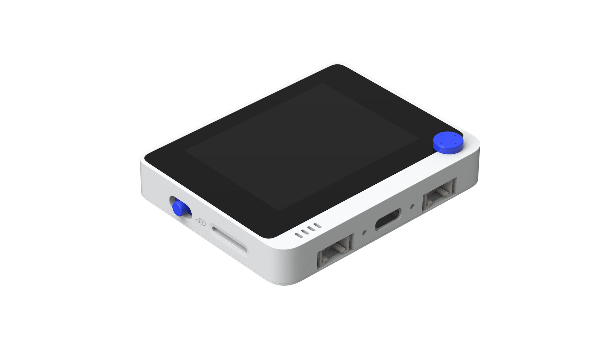

# SeeedWioTerminalTestRun

Experiments and apps for the [Seeed Wio Terminal](https://www.seeedstudio.com/Wio-Terminal-p-4509.html) using Arduino IDE. The goal is to explore what the hardware can do: displays, Grove modules, BLE, and beyond.

## Hardware

[Seeed Wio Terminal](https://www.seeedstudio.com/Wio-Terminal-p-4509.html): SAMD51, 320×240 LCD, 5-way joystick, 3 top buttons, RTL8720DN BLE/Wi-Fi, Grove connectors.

Board and library setup instructions are on the [getting started page](https://wiki.seeedstudio.com/Wio-Terminal-Getting-Started/).

## WTApp

A menu-driven app with navigation via the 5-way joystick (button C goes back).

Current screens:
- **Claude Usage**: live session and weekly API usage bars, fed via USB serial or BLE
- **Brightness**: backlight adjustment
- **Home**: placeholder for future use

### Claude Usage data sources

| Method | Script | Setup |
|---|---|---|
| USB Serial | `WTApp/serial_sender.py` | `pip install httpx pyserial` |
| Bluetooth | `WTApp/ble_sender.py` | `pip install httpx bleak` |

The BLE device name is `WT-001` — scan for this when using `ble_sender.py`.

Both scripts read your Anthropic OAuth token from `~/.claude/.credentials.json`. Run the `claude` CLI to refresh it if you get a 401.

